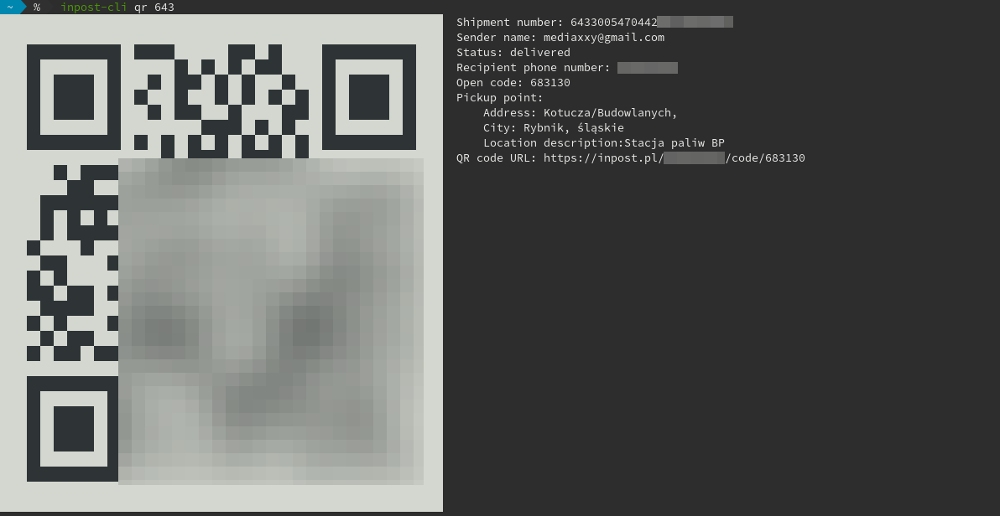

# inpost-cli

`inpost-cli` is a tool to interact with the Polish [InPost](https://inpost.pl/) storage lockers (Paczkomaty). It has the same features as the InPost mobile app.

With `inpost-cli` you can:

* ✅ View packages connected to your phone number
* ✅ Generate QR codes for opening the lockers
* ✅ Open the lockers remotely from anywhere in the world (unlike the mobile app which requires you to be physically close to the locker)

Additionally:

* ✅ Using this tool does not disable SMS notifications (unlike the app)
* ✅ Your privacy is respected, no unecessary tracking features are included.

This project was developed solely by me and is not affiliated with InPost in any way. This tool uses the same API as the Android InPost app. This program was created to enable the usage of InPost services from GNU/Linux. 

## Installation

Prebuilt binaries are available for download [at the releases page](https://github.com/alufers/inpost-cli/releases/latest). Linux (arm, arm64, and x64), macOS and windows are supported.

If you have Go installed on your system, you can compile and install `inpost-cli` this way:

```bash
$ go get -u github.com/alufers/inpost-cli
```

## Usage

First of all you will need to log in using yout phone number. Issue this command:

```bash
$ inpost-cli login
```

You will be asked for your phone number and then you will recieve a SMS message containng a code which you have to enter. Now you can use all the features of the tool.

## Viewing package data

For example you can list all your packages:

```bash
$ inpost-cli ls
+--------------------------+-------------------------+-----------+-----------------------------+--------+-----------+------------+
|     SHIPMENT NUMBER      |         SENDER          |  STATUS   |        PICKUP POINT         |  CITY  | OPEN CODE | STORED FOR |
+--------------------------+-------------------------+-----------+-----------------------------+--------+-----------+------------+
| 642600027844200234823732 | ACME INC                | delivered | RYB01N Raciborska 121       | Rybnik |           |            |
| 622400717844200217633243 | Jan Paweł II Sp. J.     | delivered | RYB847 Kotucza/Budowlanych  | Rybnik |           |            |
| 618400489044200213661457 | example@example.com     | delivered | RYB01N Raciborska 121       | Rybnik | 852830    |            |
| 626600367044200218874897 | Drzwi                   | delivered | RYB05M Wawelska 2           | Rybnik | 538810    |            |
| 605077267044200211409628 | Aperture Science        | delivered | RYB05M Wawelska 2           | Rybnik | 515700    |            |
| 653238947044200210962767 | Black mesa              | delivered | RYB01N Raciborska 121       | Rybnik | 935718    |            |
| 643300547044200218603085 | kontakt@2137.pl         | delivered | RYB07A Sławików 2A          | Rybnik | 683130    |            |
+--------------------------+-------------------------+-----------+-----------------------------+--------+-----------+------------+
```

You can filter the packages by status...

```bash
$ inpost-cli ls -s ready_to_pickup
```

...or output the data in JSON.

```bash
$ inpost-cli ls -s out_for_delivery -f json
```

### Retrieving your parcels

When the package is ready to pick up you may either generate a QR code in the terminal to open the locker:

```bash
$ inpost-cli qr <shipment-number>
```



TIP: You don't have to enter the whole shipment number, just the few first digits to differentiatie between your parcels.

Alternatively you can use the remote-open feature.

```
$ inpost-cli open <shipment-number>
Warning: You are about to remotely open a compartment in the pick-up machine (Paczkomat)
Warning: Please double check that you are nearby the correct machine. Somebody can steal your package if you make a mistake!
Press 'y' and enter to open compartment at Raciborska 121, Rybnik (Stacja paliw BP) for shipment number 618400489044200213661457 from example@example.com: \n (n):
```

`inpost-cli` does not check whether you are close to the locker, so you can remotely open the compartment for somebody else.

For help use:

```
$ inpost-cli help
```

## Contributing
Pull requests are welcome. For major changes, please open an issue first to discuss what you would like to change.

## Disclaimer

```
THE SOFTWARE IS PROVIDED "AS IS", WITHOUT WARRANTY OF ANY KIND, EXPRESS OR IMPLIED, INCLUDING BUT NOT LIMITED TO THE WARRANTIES OF MERCHANTABILITY, FITNESS FOR A PARTICULAR PURPOSE AND NONINFRINGEMENT. IN NO EVENT SHALL THE AUTHORS OR COPYRIGHT HOLDERS BE LIABLE FOR ANY CLAIM, DAMAGES OR OTHER LIABILITY, WHETHER IN AN ACTION OF CONTRACT, TORT OR OTHERWISE, ARISING FROM, OUT OF OR IN CONNECTION WITH THE SOFTWARE OR THE USE OR OTHER DEALINGS IN THE SOFTWARE.
```

## License
[MIT](https://choosealicense.com/licenses/mit/)